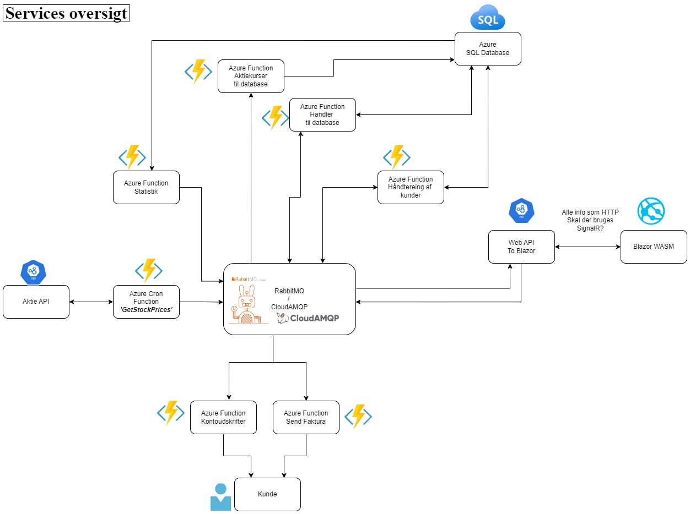

 

# AfgangsProjekt
Kode til forskellige services i forbindelse med mit afgangsprojekt på SmartLearning.

Herunder er der et diagram over de forskellige services i projektet og flowet imellem dem.

