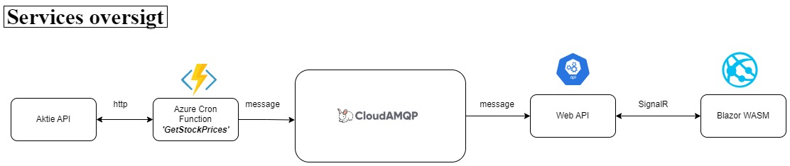
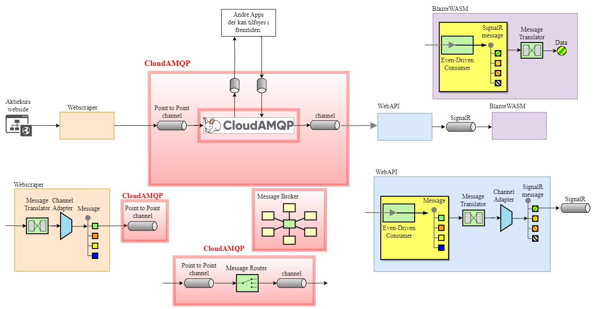
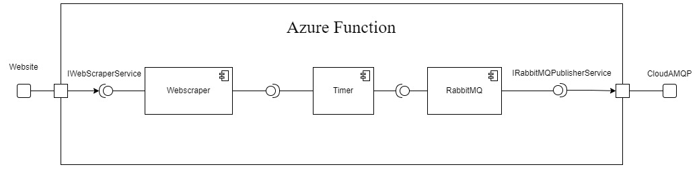
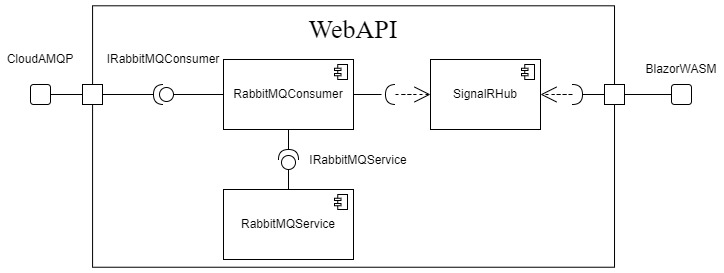

 

 

# AfgangsProjekt
### Diagram over de forskellige services i projektet og flowet imellem dem.

Kode til de forskellige services i forbindelse med mit afgangsprojekt på SmartLearning.  
For at koden og tests kan køre skal koden bygges først.

Min løsning på afgangsprojektet består af en række projekter med hver sin funktionalitet.

- AP.API er et minimalt webapi der henter beskeder fra CloudAMQP og sender dem videre med SignalR.  
  Her er der 2 interfaces IRabbitMQConsumer og IRabbitMQService.  
  Der er også min SignalR hub, "thehub".

- AP.APITests indeholder nogle tests for API´et.

- AP.BlazorWASM er projektet med min frontend SPA.  
  Det indeholder kun en side, Index.razor.

- AP.BlazorWASMTests indeholder tests til min BlazorWASM.

- AP.ClassLibrary er mit classlibrary med fællesklasser og metoder til brug i hele løsningen.  
  Her er også statiske endpoints.

- AP.FuntionTests er tests til min Azure Function applikation og dens afhængigheder.

- AP.GetStockPrices er min Azure Function med en Timer Function og de 2 interfaces IWebscraperService og IRabbitMQPublisherService.  
  Herfra bliver der sendt aktiekurser videre til CloudAMQP som beskeder.
 
 

### Der er også mulighed for at se de øvrige diagrammer:
 

Enterpise Integration Patterns diagram

 
 
Azure Timer Function komponent diagram

 
 
Minimal Web API komponent diagram

